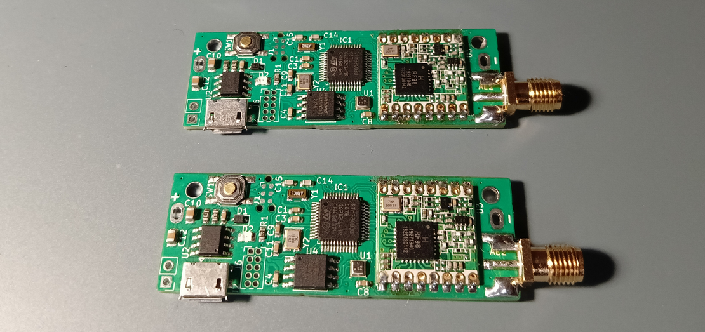
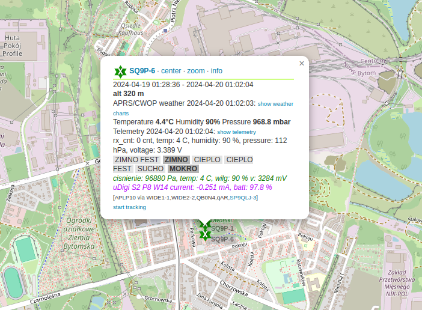
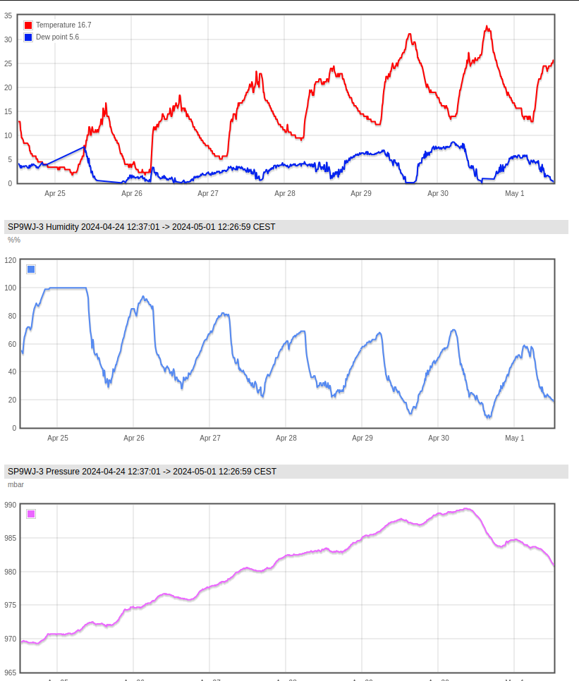

# uDigi docs

1. [Rx configuration](./docs/rx_configuration.md)
2. [Digipeating configuration](./docs/digi_configuration.md)
3. [Alarms configuration](./docs/alarms_settings.md)
4. [Software update](./docs/software_update.md)
5. [Battery life estimations](./docs/battery_life_estimations.md)

#

