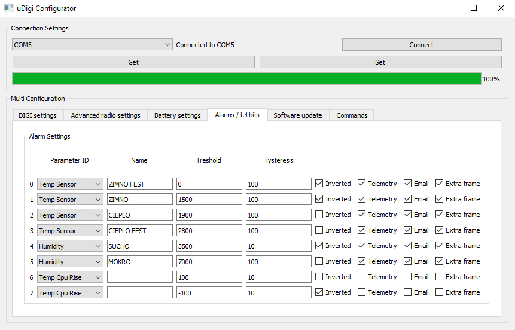
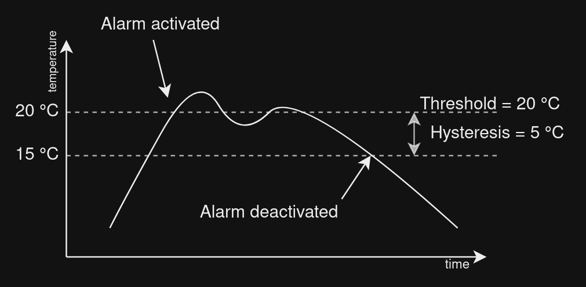
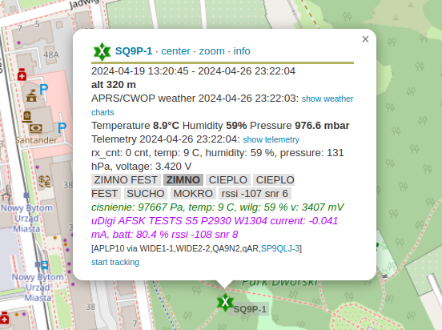

# Alarm settings, telemetry bits
[<--- BACK TO MAIN PAGE](../README.md)
1. [Threshold and Hysterisis](#thresholds)
2. [Telemetry bits](#telemetry_bits)
3. [Parameters and units](#parameters)

  

## Threshold and Hysterisis

Current alarm algorithm, supports simple treshold triggering with hysterisis

To activate alarm when value drops below threshold, check **Inverted** checkbox.

  

## Telemetry bits

Select **Telemetry** checkbox to add alarm to APRS telemetry bits.

## Parameters and units

| Parameter       | Unit            |
| :---            |    ---:         |
| Voltage         | mV              |
| VoltageChange   | mV/s            |
| TempCpu         | C * 10^-2       |
| TempCpuRise     | mC/s            |
| TempSensor      | C * 10^-2       |
| TempSensorRise  | mC/s            |
| Press           | Pa              |
| PressRise       | mPa/s           |
| Hum             | % * 10^-2       |
| HumRise         |  % * 10^-3 / s  |