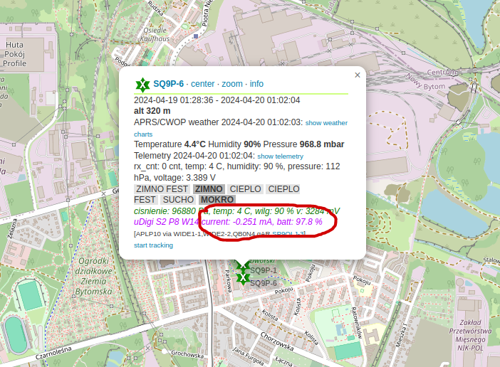

# Battery life estimations
[<--- BACK TO MAIN PAGE](../README.md)
1. [Battery life estamination](#ble)
2. [Power consumption table](#pc)

## Battery life estamination

| Mode   | average current | 1x lithium battery AA (2700 mAh) | 1x lithium battery R20 (19000 mAh) |
| :---| :---: |:---: |:---: |
| only Wx (15 min beacon inteval, digi off)| 101 uA | 3 years |21 years |
| only Wx (30 min beacon inteval, digi off)| 62 uA | 4.97 years |35 years |
| max for Wx + Digi (15 min beacon inteval, 350 ms RX sampling period)| 295 uA | 0.3 - 1.04 years | 2 - 7.35  years |

**Warning** these calculations are based on ideal conditions, there are factors that can affect lifetime: proper protection of PCB and batteries from moisture. Batteries also degrade over time, it is worth considering an additional error margin of about 20%.  
Calculating digi lifetime is hard beacause its strictly dependent on traffic intensity on the APRS network.

## Power consumption table
### constant currents

| Mode                                       | Current            |
| :---                                       |    ---:            |
| base - sleep current                       | 13 uA              |
| Sensor, (measurement every 10s) averaged   | 3 uA              |
| lnode network, averaged                    | 7 uA              |
|                                     |            |
| ***sum***                                 | ***23uA***           |

### configuration dependent consumption

| Mode                                        | Energy            |
| :---                                        |    ---:            |
| single TX energy (LORA 1200, 100 B packet)  | 70 mC              |
| single RX sample energy (LORA 1200)         | 0.074 mC           |

to get average current consumption in uA of exact component, divide component energy by configured period.  
#### calculation example for average beacon tx current:
configured **Beacon inverval = 15 min**  
Average Current = 70 mC / 900 s = 0.078 mA = 78 uA

