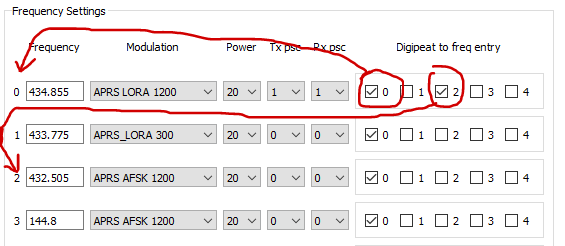

# Digi configuraton
[<--- BACK TO MAIN PAGE](../README.md)
1. [Frequency settings](#fset)
2. [Tx & Rx prescalers](#psc)
3. [Digipeating table](#multi_rx)

## Frequency settings

You can set up to 4 frequencies entries. Radio chip supports frequency range from 137 to 525 MHz, but PCB has soldered RF filters for 70 cm band.

## Tx & Rx prescalers
**Tx psc** setting can be used to set the beacon transmission ratio for selected frequency entries.  
**Rx psc** is used to set the ratio of frequencies being sampled in multi-frequency receive mode. More info - [Rx configuration](./rx_configuration.md)

## Digipeating table
Each frequency entry is numbered from 0 to 3, by using checkboxes in the digipeating table you can chose on which frequency APRS packed should be digipeated.

In this example, when a packet is received on frequency entry 0 (434.855 LORA 1200), it will be digipeated on the same frequency (0 checked), and on entry 2, which is 432.505 AFSK 1200.