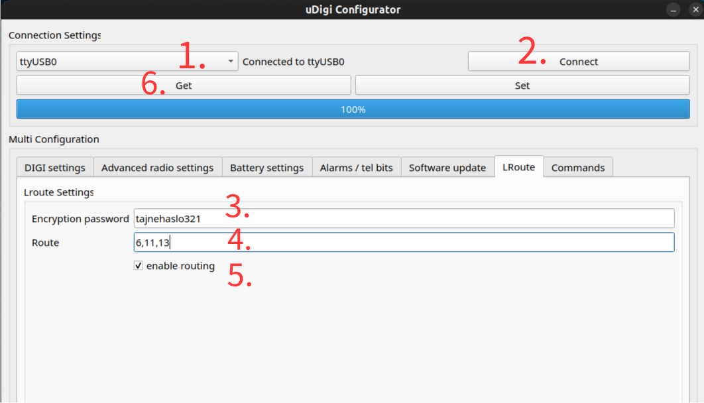
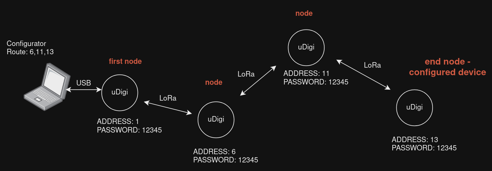
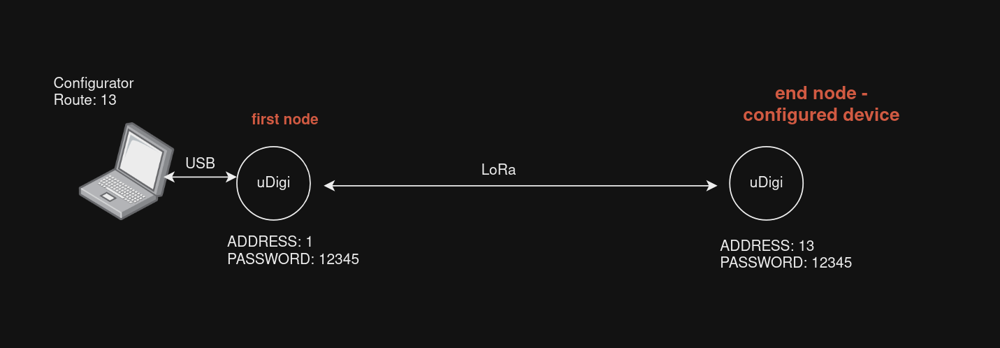

[<--- BACK TO MAIN PAGE](../README.md)

# Remote configuration via radio
Every digi acts as a node in mesh network that is used for remote configuration or software update.

Lroute in configurator acts as a intermediary mode, after turning **enable routing** on, all configuration settings in other tabs are related to device of address specified at the end of the path. Remote configuration requres one uDigi pcb connected to PC via usb cable, that will act as radio interface.

## Connecting to remote digi

Ensure that digi connected to pc is in configuration mode if not press button 3 times and wait until led will blink in 1 s interval.

1. Select usb COM port.
2. Connect to local digi via usb.
3. Check if configured password is same as in all others digis in path
4. Specify path, the last entry will be address of digi you want to configure. To connect directly, without nodes, write only destination address.
5. Check **enable routing**, when it is selected all configuration commands will be routed to destination address.
6. Press **Get** to establish connection, depending on number of nodes and link quality in can take up to 1 minute.
7. After establishing connection, progress bar should load to 100% and read configuration of the end node device.

After this steps, as long as **enable routing** box will be checked, configuration contents and operations like **Get**, **Set** and firmware update will be routed to remote device.

## Route values examples
### Mesh example

* Route: 6,11,13
* Password: 12345

### Direct example

* Route: 13
* Password: 12345