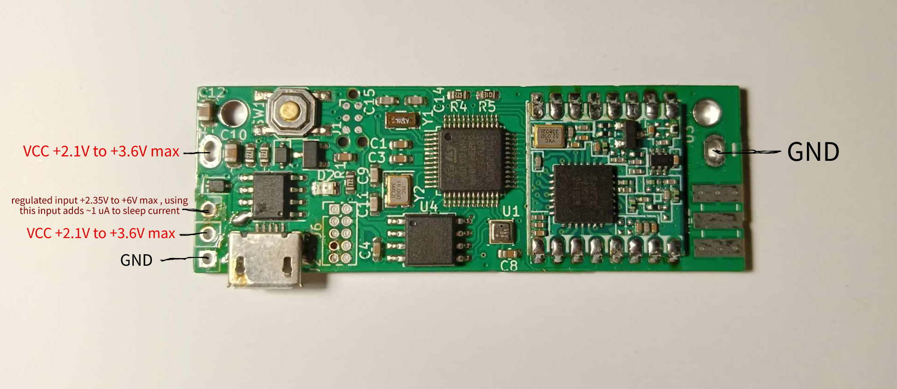

# Power supply
[<--- BACK TO MAIN PAGE](../README.md)
1. [Power inputs](#pin)

  

## Power inputs

Digi can be powered from battery or any voltage source that provides voltage within supported range.
Device have two voltage inputs and common ground:
* direct input - from 2.1V to 3.6V
* regulated input - from 2.35V to 6V

At the same time only one voltage input should be connected to the power source.