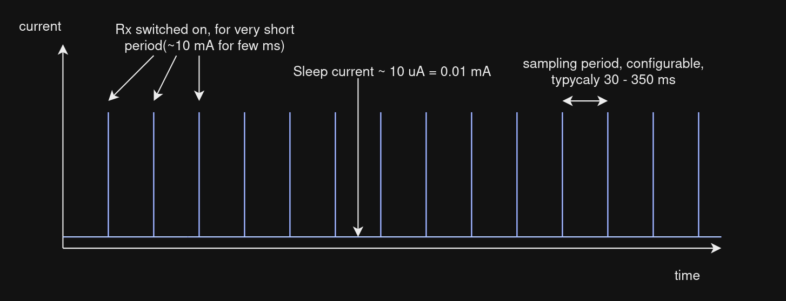
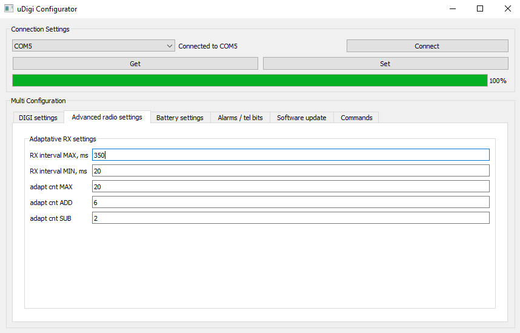
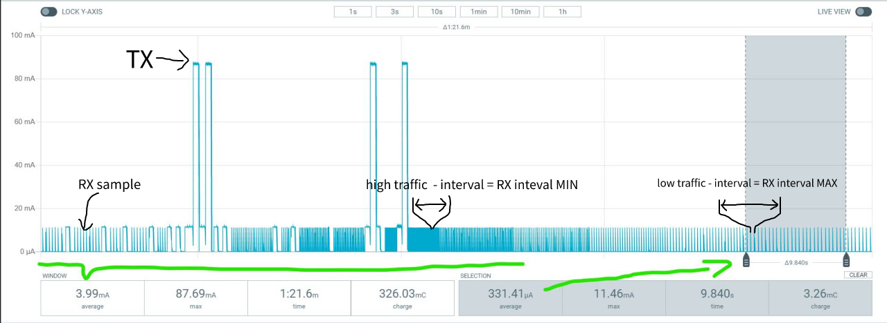
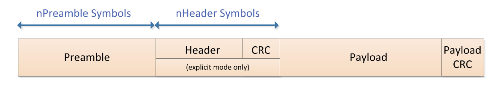
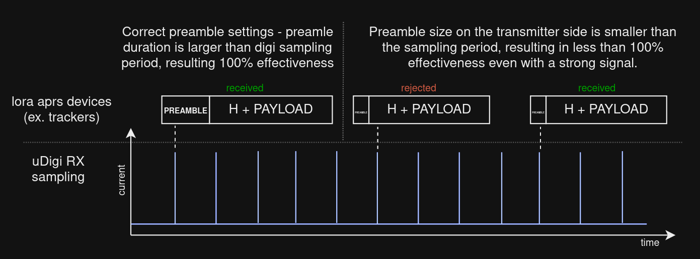
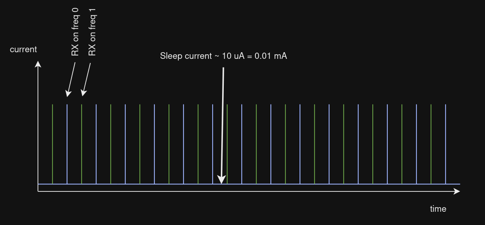
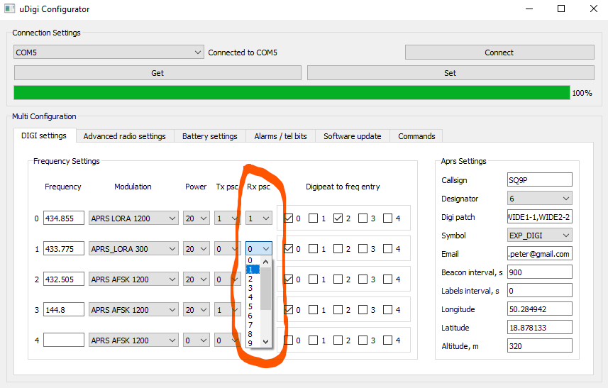

# RX configuration
[<--- BACK TO MAIN PAGE](../README.md)
1. [How the uA currents are achieved in RX](#init)
2. [RX sampling configuration window](#rx_conf)
3. [Why TX preamble size is important](#multi_rx)
4. [Multiple Frequency Listening](#multi_rx)

  

## How the uA currents are achieved in RX 

The uDigi receiver operates in a sampled RX mode - it wakes up for a very short period to check if signal is present. This mode allows to lower an average current lower than the radio chip's declared continuous RX current.

  

Chart above shows how current changes vs time. Here are the main principles for power consumption:
* The average current depends strictly on the time configured between RX samples.
* Optimal power consumption is achieved when the sampling period is set as constant (digi also supports an adaptive period).

  

## RX sampling configuration window
  

### constant sampling configuration
To configure constant sampling period, set both **RX interval MAX** and  **RX interval MIN** to the same value. For example to set sampling period to 350 ms:
* **RX interval MAX**  = 350
* **RX interval MIN**  = 350

### adaptative sampling
When other lora devices like trackers transmit short preamble packets, to achieve better receive effectiveness, you can configure the adaptive mode. TThis mode reduces the sampling interval when APRS traffic is detected, increasing the possibility of receiving signals but also increasing the current usage. It can reduce the period to as short as the configured **RX Interval MIN**. In other hand, when aprs traffic is small, software autmaticly extends sampling interval to **RX interval MAX** which lowers power consumption.

  

## Why TX preamble size is important
The TX preamble length on devices that want to use your digipeater has a significant impact on the receive effectiveness of the digi. 

Each packet is preceded by a preamble that allows the receiver to synchronize and provides information that a header and payload will soon be transmitted. When the digi detects a preamble, it turns on the receiver for a short time to receive the full packet.

### bad and good configurations
  

  

## Multiple Frequency Listening
While using sampling rx mode, it is possible to listen simultaneously on different frequencies and lora modes.

  
 

You can adjust the ratio of listened frequencies using the **Rx PSC** settings.