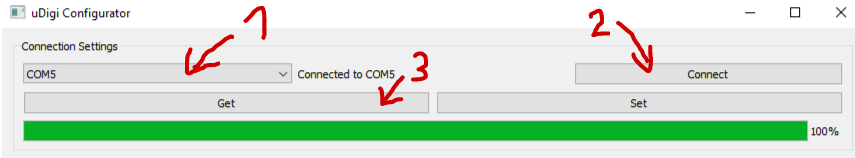

[<--- BACK TO MAIN PAGE](../README.md)

# How to enter configuration mode
* Make sure digi is powered from external source in accetable range (2.1 - 3.6 V)
* Press button 3 times shortly
* Wait for the led to start blinking in 1 second interval
* Connect USB cable
* Select proper COM port in udigi configurator
* Press "Connect"

**Warning** Usb port isn't desinged to act as a power supply, connect battery before entering configuration mode.

## Reading configuration
To read configuration from device, press **GET** button.

## Writing configuration
To write configuration to the device, press **SET** button.

## Restore defaults
To reset configuration to factory state, switch to **Commands** tab, and press **reset configuration** button.

## Exiting configuration mode
uDigi will automaticly exit configuration mode if there was no USB communication longer than 5 minutes. To manualy exit confguration mode, press button once and wait while led stops blinking.